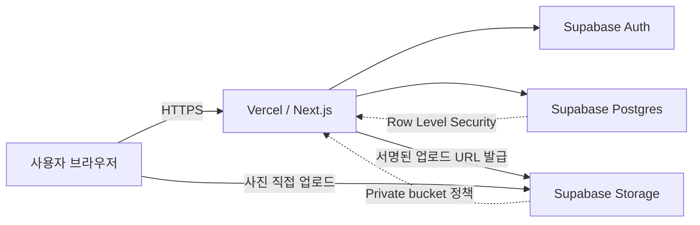

# ADR-0001: 무료 티어 기반 웹 애플리케이션 아키텍처

- 상태: 승인됨
- 결정일: 2026-08-16
- 대상: Cafe Scout MVP
- 관련 문서: [PRD](../cafe_scout_mvp_prd.md), [SPEC](../SPEC.md)

## 1. 맥락

Cafe Scout MVP는 카페 방문 정보를 기록하고, 관찰한 좌석 수, 고객 수, 객단가, 체류시간, 운영시간을 바탕으로 예상 매출을 계산하는 웹 애플리케이션이다. 사진을 포함한 방문 기록의 생성, 수정, 조회와 최대 3개 기록 비교를 지원해야 한다.

초기 검증 단계의 고정 제약은 다음과 같다.

- 월 고정비 없이 배포하고 운영한다.
- 한 명 또는 극소수의 검증 사용자를 대상으로 한다.
- 모바일 현장 입력과 데스크톱 조회를 모두 지원한다.
- 별도 서버를 관리하지 않는다.
- 관계형 데이터와 이미지 파일을 영속 저장한다.
- 빠른 기능 수정과 반복 배포가 가능해야 한다.

무료 플랜의 용량과 정책은 수시로 변경될 수 있다. 이 ADR은 결정일의 공식 정책을 기준으로 하며, 구체적인 제공량보다 무료 플랜 안에서 동작하는 구조를 우선한다.

## 2. 결정

다음 기술과 배포 구성을 채택한다.

| 영역                         | 결정                                                     |
| ---------------------------- | -------------------------------------------------------- |
| 웹 프레임워크                | Next.js App Router                                       |
| 언어                         | TypeScript strict mode                                   |
| 프론트엔드 및 서버 실행 환경 | Vercel Hobby                                             |
| 데이터베이스                 | Supabase Postgres                                        |
| 파일 저장소                  | Supabase Storage의 private bucket                        |
| 접근 인증                    | Supabase Auth, 초대된 운영자만 로그인 허용               |
| 데이터 접근                  | Next.js 서버 경계와 Supabase RLS를 함께 사용             |
| 입력 검증                    | 공유 TypeScript 스키마를 클라이언트와 서버 양쪽에서 적용 |
| 배포                         | Git 저장소의 기본 브랜치를 Vercel production에 자동 배포 |
| DB 변경                      | 저장소에 버전 관리되는 Supabase migration으로만 적용     |

이 결정은 비상업적 제품 검증용 MVP에 한해 승인한다. Vercel Hobby는 공식 정책상 비상업적 개인 용도로 제한되므로, 유료 서비스 출시, 수익 활동, 업무용 운영으로 전환하기 전에 Vercel Pro 전환 또는 다른 호스팅 선택을 위한 새 ADR이 필요하다.

## 3. 아키텍처



### 3.1 Next.js 애플리케이션

- App Router와 React Server Components를 기본으로 사용한다.
- 조회 화면은 Server Component에서 데이터를 가져오고, 상호작용이 필요한 폼과 비교 선택만 Client Component로 분리한다.
- 생성, 수정, 삭제는 Server Action 또는 Route Handler를 통해 수행한다.
- 사용자별 비공개 데이터는 정적 생성하거나 공유 캐시에 저장하지 않고 동적으로 조회한다.
- 생성, 수정, 삭제 후 관련 리스트·상세·비교 조회를 명시적으로 무효화한다.
- 서버 런타임은 기본적으로 Node.js를 사용한다. Edge Runtime은 필요한 라이브러리 호환성과 동작이 검증된 경우에만 사용한다.
- `strict: true`를 유지하고 `any` 사용은 외부 라이브러리 경계 외에는 허용하지 않는다.

권장 모듈 경계는 다음과 같다.

```text
src/
  app/                 # 라우트, 페이지, Server Action
  features/            # 방문 기록, 비교, 사진 업로드 기능
  domain/              # 매출 추정, 신뢰도 계산, 도메인 타입
  lib/supabase/        # browser/server Supabase client
  lib/validation/      # 공유 입력 스키마
  types/database.ts    # DB 스키마에서 생성한 타입
supabase/
  migrations/          # SQL migration
  seed.sql             # 로컬 개발 데이터
```

### 3.2 데이터와 매출 계산

- Postgres 스키마는 SPEC의 `Cafe`, `CafeVisit`, `CafePhoto`, `CafeMenu`, `CafeBusinessSnapshot`을 기준으로 구현한다.
- 모든 사용자 소유 레코드는 `owner_id`를 가지며 인증 사용자 ID를 참조한다.
- 부모와 자식에는 `(id, owner_id)` unique key와 `(parent_id, owner_id)` 복합 FK 또는 동등한 DB 제약을 두어 서로 다른 소유자의 레코드가 연결되지 않게 한다.
- `owner_id`는 생성 후 변경할 수 없게 한다.
- RLS 정책은 기본 거부로 시작하고, `select`, `update`, `delete`에는 `USING (owner_id = auth.uid())`, `insert`와 `update`에는 `WITH CHECK (owner_id = auth.uid())`를 적용한다.
- 예상 매출과 신뢰도 계산은 외부 API를 호출하지 않는 순수 TypeScript 함수로 구현한다.
- 입력 중 즉시 미리보기는 브라우저에서 계산하고, 저장 snapshot은 DB transaction의 단일 계산 함수가 만든다. 두 런타임의 일치는 [ADR-0003](./0003-cross-runtime-estimation-contract.md)의 버전화된 계약과 parity integration test로 강제한다.
- 계산 결과에는 `estimation_model_version`을 함께 저장해 공식 변경 후에도 기존 결과를 재현할 수 있게 한다.
- 금액은 부동소수점이 아닌 정수 KRW로 저장한다.
- DB 스키마 타입은 migration 적용 후 생성하며, 애플리케이션의 수기 DB 타입과 병행하지 않는다.

### 3.3 인증과 보안

PRD에서 제외한 것은 회원 가입, 프로필, 초대 관리, 역할 관리 같은 제품 기능이다. 공개 배포의 익명 쓰기는 허용하지 않는다.

- Supabase Auth에는 검증 운영자 계정만 사전 생성한다.
- 공개 회원 가입은 비활성화한다.
- 애플리케이션에는 최소 로그인/로그아웃만 제공하고 계정 관리 UI는 구현하지 않는다.
- 브라우저에는 Supabase URL과 publishable key만 노출할 수 있다.
- `service_role` key는 브라우저 번들에 포함하지 않으며 Vercel 애플리케이션 런타임에서도 사용하지 않는 것을 원칙으로 한다.
- 서버도 사용자 세션으로 Supabase에 접근하여 RLS를 우회하지 않는다.
- 관리자 권한이 필요한 migration과 초기 계정 작업은 배포 런타임이 아닌 로컬 관리 절차에서 수행한다.
- 오류 로그에 세션 토큰, 환경 변수, 사진 URL의 서명값, 사용자의 자유 입력 메모를 기록하지 않는다.

필수 환경 변수는 아래와 같다.

```text
NEXT_PUBLIC_SUPABASE_URL
NEXT_PUBLIC_SUPABASE_PUBLISHABLE_KEY
```

개발, Preview, Production 환경의 키를 분리한다. `.env*` 실제 값은 Git에 커밋하지 않는다.

### 3.4 사진 업로드

Vercel Function의 요청 및 응답 본문에는 크기 제한이 있으므로 사진 바이너리를 Next.js 서버가 중계하지 않는다.

1. 브라우저는 선택된 이미지를 로컬에서 방향 보정, 리사이즈, 압축하되 저장 CTA 전에는 업로드하지 않는다.
2. 사용자가 저장하면 서버가 폼을 검증하고 Cafe/Visit/메뉴/snapshot을 DB transaction으로 먼저 저장해 방문 ID를 확정한다.
3. 인증된 사용자가 처리된 파일명, MIME type, 크기와 방문 ID를 서버에 전달한다.
4. 서버는 저장된 방문의 소유권과 파일 경로를 검증한 뒤 사용자 세션으로 Supabase Storage signed upload URL을 발급한다. 이 동작에 필요한 `storage.objects`의 `insert` 정책을 최소 범위로 허용한다.
5. 브라우저가 해당 URL로 Supabase Storage에 직접 업로드한다.
6. 서버는 업로드된 object의 존재와 Storage가 기록한 MIME type/크기를 확인한 후 bucket/object path, 종류, 순서, MIME type, 크기와 클라이언트 처리 결과의 이미지 크기를 DB에 저장한다.

사진 업로드 실패는 이미 저장된 방문 기록을 롤백하지 않는다. UI는 `기록 저장됨 · 사진 업로드 미완료` 상태와 재시도를 제공한다. Storage 업로드 후 DB metadata 저장이 실패하면 해당 object를 즉시 보상 삭제하고, 삭제도 실패하면 고아 object 정리 절차의 대상으로 남긴다.

Storage bucket은 private으로 유지한다. 조회 시에는 만료 시간이 짧은 signed URL을 생성한다. 영구 public URL은 저장하지 않고 bucket과 object path만 DB에 저장한다.

무료 Storage 사용량을 보호하기 위해 업로드 전에 브라우저에서 이미지 방향을 보정하고 리사이즈 및 압축한다. 애플리케이션 정책은 다음과 같다.

- 허용 형식: JPEG, PNG, WebP
- 파일당 업로드 크기: 최대 3 MB
- 긴 변 기준: 최대 1,600 px
- 방문 기록당 사진 수: SPEC의 일반 사진 10장, 메뉴판 3장 제한 적용
- bucket의 MIME type과 파일 크기 제한도 애플리케이션 정책과 동일하게 설정
- 수정 시 object path를 먼저 확보하고 DB metadata를 삭제한 뒤 Storage object 삭제를 시도하며, 실패한 object는 관리 절차에서 재시도
- 방문 삭제 시 object path를 먼저 확보하고 DB 레코드를 삭제한 뒤 Storage 삭제를 시도하며, 실패한 object는 관리 절차에서 재시도

### 3.5 배포 환경

| 환경       | 실행 위치                   | 데이터                   |
| ---------- | --------------------------- | ------------------------ |
| Local      | 로컬 Next.js + Supabase CLI | 로컬 DB/Storage          |
| Preview    | Vercel Preview              | 개발용 Supabase 프로젝트 |
| Production | Vercel Production           | 운영용 Supabase 프로젝트 |

- Preview가 Production DB를 참조하지 않게 환경 변수를 분리한다.
- 무료 프로젝트 수가 부족하면 Preview는 로컬 검증으로 대체하며 Production 연결을 재사용하지 않는다.
- Supabase 프로젝트 지역과 Vercel Function 지역은 가능한 한 가까운 리전을 선택한다.
- 애플리케이션 표시 시간대는 SPEC에 따라 `Asia/Seoul`로 고정하고, DB의 시각은 `timestamptz`로 저장한다.
- schema migration은 먼저 개발 환경에서 검증한 뒤 Production에 적용한다.
- 하위 호환이 없는 migration과 애플리케이션 코드를 한 번에 배포하지 않는다. 컬럼 추가, 코드 전환, 구 컬럼 제거 순서의 확장/축소 방식을 사용한다.

## 4. 무료 운영 제약

### 4.1 허용 범위

무료 운영 목표는 트래픽이 적은 비상업적 MVP 검증이다. 무료 티어 한도를 SLA로 간주하지 않는다.

- Vercel Hobby 사용량 한도 도달 시 일부 기능 또는 배포가 중단될 수 있다.
- Supabase Free 프로젝트는 활동이 적으면 일시정지될 수 있어 상시 가용성을 보장하지 않는다.
- Supabase Free에는 자동 백업이 제공되지 않으므로 중요한 데이터의 유일한 보관소로 간주하지 않는다.
- 이미지 변환 서비스에 의존하지 않고 업로드 전에 클라이언트에서 크기를 줄인다.
- 무료 플랜의 대시보드 사용량과 정책을 월 1회 확인한다.
- 일시정지를 피하기 위한 인위적인 keep-alive 요청은 운영하지 않는다.

### 4.2 백업과 복구

- Production schema는 migration 파일로 복구할 수 있어야 한다.
- 중요한 사용자 검증 전과 파괴적 migration 전에 DB를 수동 export한다.
- 사진 원본이 반드시 보존되어야 하는 단계가 되면 별도 백업 저장소 또는 유료 플랜을 검토한다.
- 복구 절차는 빈 Supabase 프로젝트에 migration 적용, DB 데이터 import, Storage 파일 복원 순서로 검증한다.

## 5. 선택 이유

### 5.1 Next.js + Vercel

- 한 저장소에서 반응형 UI, 서버 렌더링, 서버 작업을 구현할 수 있다.
- Git 기반 Preview와 Production 배포가 기본 제공되어 별도 CI/CD 서버가 필요 없다.
- MVP 규모에서 서버 프로비저닝과 운영체제 관리가 필요 없다.
- TypeScript를 클라이언트와 서버에서 공유해 입력 타입과 매출 계산 로직의 불일치를 줄일 수 있다.

### 5.2 Supabase

- 방문, 메뉴, 사진, 계산 스냅샷의 관계를 Postgres의 외래키와 transaction으로 표현할 수 있다.
- Auth, Postgres, Storage를 한 프로젝트에서 제공해 무료 운영에 필요한 외부 서비스 수를 줄인다.
- RLS로 브라우저와 서버 양쪽의 데이터 소유권 규칙을 DB에서 강제할 수 있다.
- SQL migration과 생성 타입을 저장소에서 관리할 수 있다.

## 6. 검토한 대안

| 대안                                   | 채택하지 않은 이유                                                                |
| -------------------------------------- | --------------------------------------------------------------------------------- |
| Next.js + 로컬 브라우저 저장소         | 기기 간 데이터 유지가 어렵고 사진 백업과 데이터 복구가 취약함                     |
| Firebase                               | 현재 데이터가 관계형이고 방문 기록 비교와 집계에 SQL이 더 직접적임                |
| 별도 Express/NestJS 서버               | MVP에서 배포 대상과 운영 복잡도가 늘어나며 Next.js 서버 기능으로 충분함           |
| 직접 관리하는 VM                       | 서버 패치, HTTPS, DB, 백업 운영이 필요해 무관리·무료 제약과 맞지 않음             |
| 별도 Postgres + 별도 오브젝트 스토리지 | 서비스와 자격 증명, 장애 지점이 늘어나 초기 운영 비용이 커짐                      |
| 브라우저에서 Supabase 직접 CRUD        | 클라이언트에 저장 규칙이 분산되고 서버 재계산 및 감사 가능한 경계를 만들기 어려움 |
| JavaScript                             | 폼, DB, 계산 모델 사이의 계약을 컴파일 시점에 검증할 수 없음                      |

## 7. 결과와 트레이드오프

긍정적 결과:

- 월 고정비 없이 MVP를 배포할 수 있다.
- 프론트엔드, 서버, DB, Storage의 운영 부담이 작다.
- TypeScript 도메인 함수를 공유해 실시간 미리보기와 저장 결과를 일치시킬 수 있다.
- Postgres와 RLS로 데이터 관계 및 소유권을 명시적으로 보장한다.

감수하는 비용:

- Vercel과 Supabase에 대한 플랫폼 의존성이 생긴다.
- 무료 티어의 일시정지, 사용량 제한, 자동 백업 부재로 상시 가용성과 데이터 내구성을 보장할 수 없다.
- 사진 직접 업로드, signed URL, private bucket 처리로 단순 폼 업로드보다 구현이 복잡해진다.
- 제품 범위에는 없는 최소 인증 흐름이 보안상 필요하다.
- 상업 운영이 시작되면 현재의 Vercel Hobby 선택을 그대로 유지할 수 없다.

의존성을 제한하기 위해 매출 계산과 신뢰도 계산은 Supabase SDK와 분리된 순수 함수로 유지하고, SQL schema 및 migration을 저장소에서 관리한다.

## 8. 검증 기준

구현 완료 시 다음 조건을 확인한다.

- `npm run typecheck`, lint, unit test, production build가 통과한다.
- 인증하지 않은 사용자는 방문 기록과 사진을 읽거나 쓸 수 없다.
- 사용자 A는 사용자 B의 레코드와 Storage object에 접근할 수 없다.
- 사용자 A 소유의 자식 레코드를 사용자 B 소유의 부모에 연결하거나 `owner_id`를 변경할 수 없다.
- 3 MB 사진을 Vercel Function 본문을 거치지 않고 업로드할 수 있다.
- 사진 업로드가 실패해도 방문 기록은 유지되고 재시도할 수 있으며, metadata 저장에 실패한 object는 정리된다.
- 클라이언트 미리보기와 서버 저장 후 매출 계산 결과가 동일하다.
- 사용자별 비공개 조회가 정적 생성 또는 공유 캐시에 남지 않고 변경 후 최신 데이터로 갱신된다.
- Preview 배포가 Production Supabase 프로젝트를 참조하지 않는다.
- 새 Supabase 프로젝트에 migration만 적용해 schema를 재구성할 수 있다.
- 무료 사용량 한도 도달과 Supabase 프로젝트 일시정지 시 사용자에게 일반 오류 대신 복구 가능한 안내를 제공한다.

## 9. 재검토 조건

다음 중 하나가 발생하면 이 결정을 재검토한다.

- 상업적 출시 또는 수익 활동을 시작한다.
- Vercel 또는 Supabase 무료 플랜 정책이 변경된다.
- 무료 사용량의 70% 이상을 2개월 연속 사용한다.
- Supabase 일시정지로 사용자 검증이 반복해서 중단된다.
- 자동 백업, 장애 복구 목표, SLA가 필요해진다.
- 다중 사용자, 팀 권한, 외부 공유 기능이 범위에 포함된다.
- 이미지 원본 보존 또는 대용량 업로드가 필요해진다.
- 서버 기능이 Vercel Function 제한에 맞지 않게 된다.

## 10. 참고 자료

- [Vercel Hobby Plan](https://vercel.com/docs/plans/hobby)
- [Vercel Fair Use Guidelines](https://vercel.com/docs/limits/fair-use-guidelines)
- [Vercel Functions Limits](https://vercel.com/docs/functions/limitations)
- [Supabase Billing](https://supabase.com/docs/guides/platform/billing-on-supabase)
- [Supabase Free Project Pausing](https://supabase.com/docs/guides/platform/free-project-pausing)
- [Supabase Resumable Uploads](https://supabase.com/docs/guides/storage/uploads/resumable-uploads)
- [Supabase Signed Upload URLs](https://supabase.com/docs/reference/javascript/file-buckets-createsigneduploadurl)
- [Supabase Storage Downloads and Signed URLs](https://supabase.com/docs/guides/storage/serving/downloads)
